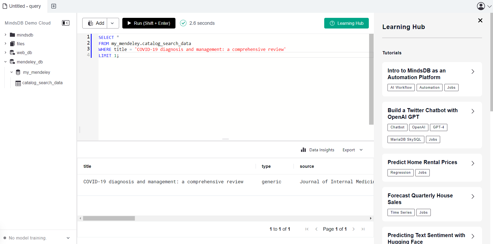
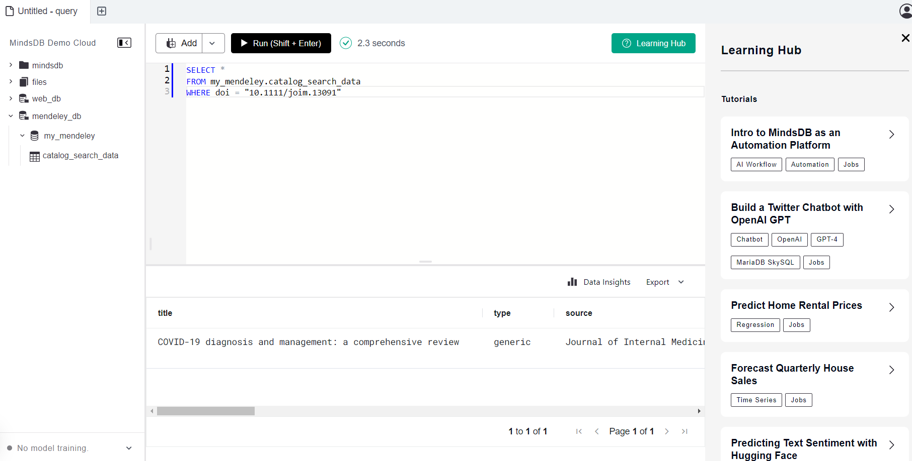
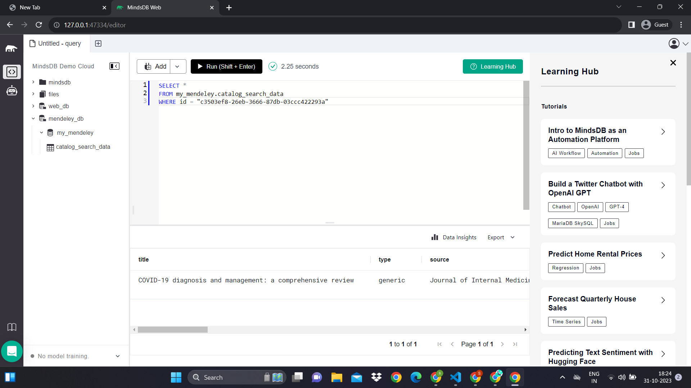

# Testing mendeley Integration

This README provides instructions for testing the Mendeley integration in MindsDB.

For more details, refer to the related [GitHub Issue](https://github.com/mindsdb/mindsdb/issues/8206).


**Description:**
### 1. This creates a database called mendeley_db. 

```
CREATE DATABASE my_mendeley
WITH
  ENGINE = 'mendeley'
  PARAMETERS = {
    "client_id" : "the client id",
     "client_secret" : "the client secret"
  };
        

```
**Screeshot Result: Query successfull**


-----

### 2. Query2

```
SELECT *
FROM my_mendeley.catalog_search_data
WHERE title = "COVID-19 diagnosis and management: a comprehensive review"
LIMIT 1;

```
**Screeshot Result: Query successfully completed**



-----

### 3. query3

```
SELECT *
FROM my_mendeley.catalog_search_data
WHERE doi = "10.1111/joim.13091"

```

**Screeshot Result:  successfull**



-----
### 4. query4

```
SELECT *
FROM my_mendeley.catalog_search_data
WHERE id = "c3503ef8-26eb-3666-87db-03ccc422293a"

```

**Screeshot Result:  successfull**



-----

## Result

The Mendeley integration has been successfully tested, and all test cases are working as expected.